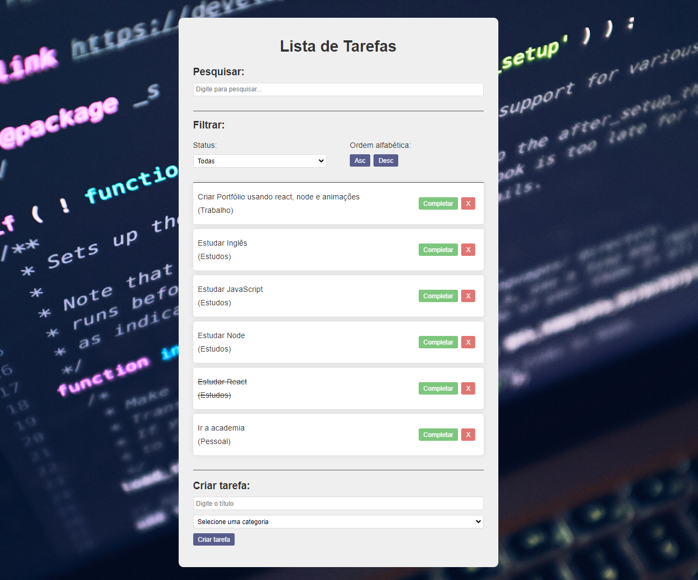

# 📂 Todo em React

## 📃 Projeto desenvolvido conforme orientações do Matheus Battisti do canal Hora de Codar

## 🚀 Tecnologias

- HTML
- CSS
- REACT
- NODE 16
- NVM

## 💻 Projeto
> Frontend da aplicação 📸

  

Instala Dependências

    npm i

  Executa projeto localmente

    npm run dev

Acessar o Projeto
[Local](http://localhost:5173) -
[Remoto](https://react-todo-delta-roan.vercel.app/)

---
---

## 📧 Contato

[LinkedIn](https://www.linkedin.com/in/wsawebmaster/)

[wsawebmaster@yahoo.com.br](mailto:wsawebmaster@yahoo.com.br)
